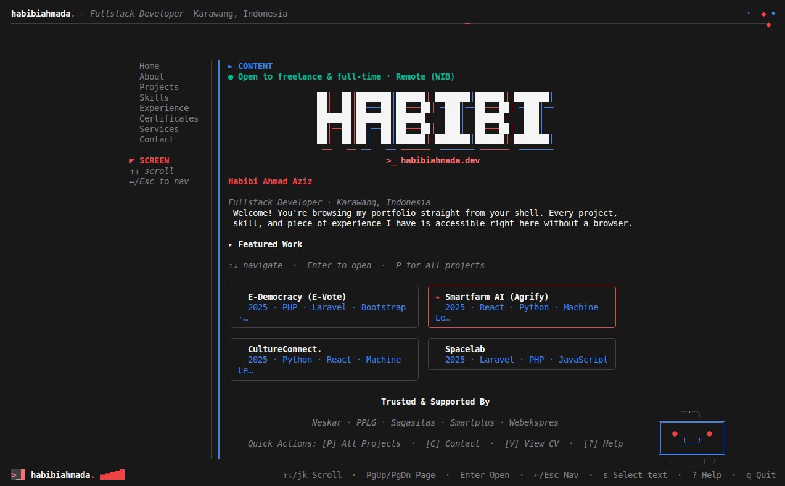

# habibiahmada-terminal

Interactive CLI portfolio untuk **Habibi Ahmad Aziz** — Full-Stack Web Developer.



Proyek ini adalah **satu Go TUI** (Bubble Tea + Lip Gloss) yang dijalankan melalui dua jalur distribusi:

```bash
npx habibiahmada          # local experience (Go binary via npm wrapper)
ssh ssh.habibiahmada.dev      # remote experience (EC2 via Wish server)
```

Website portfolio (`https://habibiahmada.dev`) dan terminal portfolio berbagi identitas visual yang sama, namun merupakan presentation layer terpisah.

---

## 🚀 Akses Cepat

| Pengguna | Perintah | Keterangan |
|---|---|---|
| **Pengguna** | `npx habibiahmada` | Jalankan langsung di laptop Anda (local binary) |
| **Pengguna** | `ssh ssh.habibiahmada.dev` | TUI interaktif via SSH (remote server) |
| **Developer** | `make dev` | Jalankan development mode |
| **Developer** | `make test` | Jalankan unit test |

---

## 🎮 Kontrol Navigasi & Input

| Tombol / Aksi | Fungsi |
|---|---|
| `↑` / `↓` / `k` / `j` | Navigasi menu sidebar / scroll konten |
| `→` / `Enter` | Masuk ke area konten / buka detail project |
| `←` / `Esc` | Kembali ke sidebar navigasi / keluar dari detail |
| `P` | *[Shortcut]* Langsung lompat ke halaman **Projects** |
| `C` | *[Shortcut]* Langsung lompat ke halaman **Contact** |
| `V` | *[Shortcut]* Buka **CV Modal Viewer** |
| `M` / Klik Mouse | *[Easter Egg]* Interaksi dengan **Maskot CRT Robot** |
| `s` / `S` | Toggle mode seleksi teks native terminal (release mouse capture) |
| `?` / `F1` | Buka / tutup overlay bantuan keyboard |
| `q` / `Ctrl+C` | Keluar dari aplikasi |

### 🖱️ Dukungan Mouse
- **Wheel Scroll**: Scroll konten ke atas dan ke bawah
- **Klik Menu / Rail**: Berpindah antar halaman
- **Klik Card Project**: Membuka halaman detail project
- **Scrollbar Drag**: Drag/klik posisi scrollbar untuk navigasi cepat
- **Klik Maskot**: Memicu animasi kedip mata & reaksi marah jika diklik berkali-kali!

---

## ✨ Fitur Unggulan

- **🎨 Red & Blue Glitch Aesthetic**: Desain dark-first bernuansa cyber-terminal modern dengan warna aksen merah (`#ef4444`) dan biru glitch (`#3b82f6`).
- **📐 Fully Responsive (Horizontal & Vertikal)**: 
  - Layout otomatis berpusat secara horizontal di layar lebar.
  - Jarak atas (*top padding*) dan viewport konten otomatis menyesuaikan dengan tinggi jendela terminal (dari split-pane IDE kecil hingga monitor 4K).
- **📦 2-Column Featured Cards**: Grid project unggulan di halaman Home yang sejajar presisi dan dapat dinavigasi langsung menggunakan keyboard (`↑↓` + `Enter`).
- **🤖 Maskot Robot CRT Interaktif**:
  - **Normal**: Animasi bernapas dan berkedip sesekali.
  - **Klik 1–2x (`M`)**: Mengedipkan mata gembira (`─ ─`, `^ ^`, `★ ★`) dan tersenyum (`╰▽╯`).
  - **Klik berkali-kali**: Menjadi marah dengan mata tajam (`◣ ◢`), border merah, dan tanda urat kemarahan **`╬` / `⑊`** (simbol anime vein tanpa emoji).
- **📄 In-App CV Modal Viewer**: Tekan `V` dari halaman Home untuk melihat ringkasan CV lengkap langsung di dalam terminal.
- **⚡ Dual Transport Core**: Satu codebase Go TUI inti yang melayani `npx` dan `ssh`.

---

## 🏛️ Ekosistem Portfolio

```
                     habibiahmada.dev
                            │
              ┌─────────────┴─────────────┐
              │                           │
           Website                     Terminal
              │                           │
   habibiahmada.dev             npx habibiahmada
              │                           │
              └───────────┬───────────────┘
                          │
                     Same Portfolio
```

| Interface | Perintah | Runtime | Ketergantungan |
|---|---|---|---|
| **Website** | `https://habibiahmada.dev` | Browser → Cloudflare → Vercel → Next.js | Supabase |
| **CLI (local)** | `npx habibiahmada` | Laptop user → Go binary → Bubble Tea | Node.js (hanya wrapper unduhan) |
| **SSH (remote)** | `ssh ssh.habibiahmada.dev` | EC2 → Wish → Go TUI | Server EC2 |

---

## 🛠️ Tech Stack

| Layer | Teknologi | Fungsi |
|---|---|---|
| **Runtime** | Go 1.22+ | Aplikasi TUI inti |
| **TUI Engine** | [Bubble Tea](https://github.com/charmbracelet/bubbletea) | State management & terminal event loop |
| **Styling** | [Lip Gloss](https://github.com/charmbracelet/lipgloss) | Layout, border, warna, dan rendering ANSI |
| **SSH Server** | [Wish](https://github.com/charmbracelet/wish) | SSH server application layer |
| **Distribusi** | npm | Binary distribution wrapper untuk `npx habibiahmada` |
| **Hosting SSH** | AWS EC2 | Server SSH remote |

---

## 📁 Struktur Proyek

```
habibiahmada-terminal/
├── assets/                   # Screenshot preview & gambar
├── cmd/
│   ├── portfolio/main.go     # Entry point local / npx
│   └── ssh/main.go           # Entry point SSH server
├── internal/
│   ├── animation/            # Framework animasi & ticker
│   ├── components/           # UI Reusable (Header, NavRail, Footer, Cards, Mascot, dll.)
│   ├── data/                 # Bundled portfolio data (Profile, Projects, Skills, dll.)
│   ├── styles/               # Definisi warna terpusat (Lip Gloss)
│   └── tui/                  # Screen views, app model, input handler, cache layout
├── npm/                      # npm package wrapper untuk npx
├── scripts/                  # Script build multi-platform & deploy
├── docs/                     # Dokumentasi arsitektur & panduan lengkap
├── go.mod
├── go.sum
├── Makefile
└── README.md
```

---

## 📋 Daftar Halaman TUI

1. **Home**: Hero banner `HABIBI`, availability badge, deskripsi, 4 featured project cards interaktif, trusted partners, dan quick actions.
2. **About**: Bio perjalanan karir, filosofi rekayasa perangkat lunak, fokus keahlian, dan statistik.
3. **Projects**: Arsip seluruh proyek dengan indikator seleksi tebal `▌`, badge `★ Featured`, tag pills, serta halaman case study detail (`←`/`→` prev/next, `Esc` back).
4. **Skills**: Skill teknis per domain (Frontend, Backend, DevOps, AI/Data) dengan visualisasi proficiency.
5. **Experience**: Riwayat pekerjaan, peranan, pencapaian kunci, serta riwayat edukasi formal.
6. **Certificates**: Sertifikasi profesional terverifikasi dengan link kredensial.
7. **Services**: Solusi dan layanan web engineering end-to-end yang ditawarkan.
8. **Contact**: Saluran kontak langsung (Email, GitHub, LinkedIn, Website) dan ketersediaan freelance/full-time.

---

## 📚 Dokumentasi Lengkap

| Dokumen | Isi |
|---|---|
| [docs/user-guide.md](docs/user-guide.md) | Panduan lengkap akses terminal (`npx`, `ssh`) & troubleshooting |
| [docs/getting-started.md](docs/getting-started.md) | Panduan setup proyek untuk developer baru |
| [docs/development-guide.md](docs/development-guide.md) | Workflow pengembangan, penambahan data, dan testing |
| [docs/design-system.md](docs/design-system.md) | Spesifikasi warna, tipografi, dan komponen Lip Gloss |
| [docs/pages.md](docs/pages.md) | Rincian konten dan struktur tiap halaman TUI |
| [docs/architecture.md](docs/architecture.md) | Arsitektur sistem, isolation layer, dan pipeline CI/CD |
| [docs/task-list.md](docs/task-list.md) | Roadmap dan status pengembangan |
| [AGENTS.md](AGENTS.md) | Panduan bagi AI Coding Assistant |

---

## 💻 Development & Pengujian

```bash
# Clone repository
git clone https://github.com/habibiahmada/habibiahmada-terminal.git
cd habibiahmada-terminal

# Unduh dependensi Go
go mod download

# Jalankan dalam development mode
make dev

# Jalankan seluruh unit test
go test ./... -count=1

# Build binary untuk semua platform (Linux, macOS, Windows)
make build
```

---

## 📄 Lisensi

Proyek ini dilisensikan di bawah lisensi [MIT](LICENSE).
